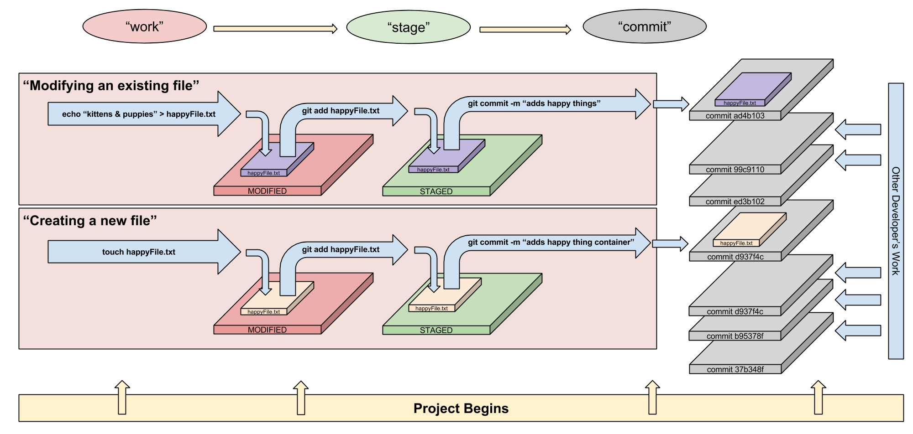

## 1.2 Hello, World

#### Morning Exercise

* Understand network topology
* Visualize a network
* Draw a network diagram

#### Data Types, Variables, and Arrays

##### Objectives

- Describe the concept of a "data type" and how it relates to variables
- Describe use cases of different "data types"
- Declare, assign to, and manipulate data stored in a variable
- Explore and use a programming or markup language's standard library and built-in functions (iterators, datatype/array methods)
- Iterate over and and manipulate values in an array
- Describe how arrays are used to store data

#### Mastering Control Flow

##### Objectives

- Differentiate between true, false, 'truth-y', and 'false-y'
- Use if/else if/else conditionals to control program flow based on boolean conditions
- Use switch conditionals to control program flow based on explicit conditions
- Use comparison operators to evaluate and compare statements
- Use boolean logic (!, &&, ||) to combine and manipulate conditionals

#### Lab: Introduction to Git & Github

- 

#### Homework

* Read a *Re-introduction to Javascript*: https://developer.mozilla.org/en-US/docs/Web/JavaScript/A_re-introduction_to_JavaScript
* Complete the **Day 2 Homework: Markdown and READMEs**
